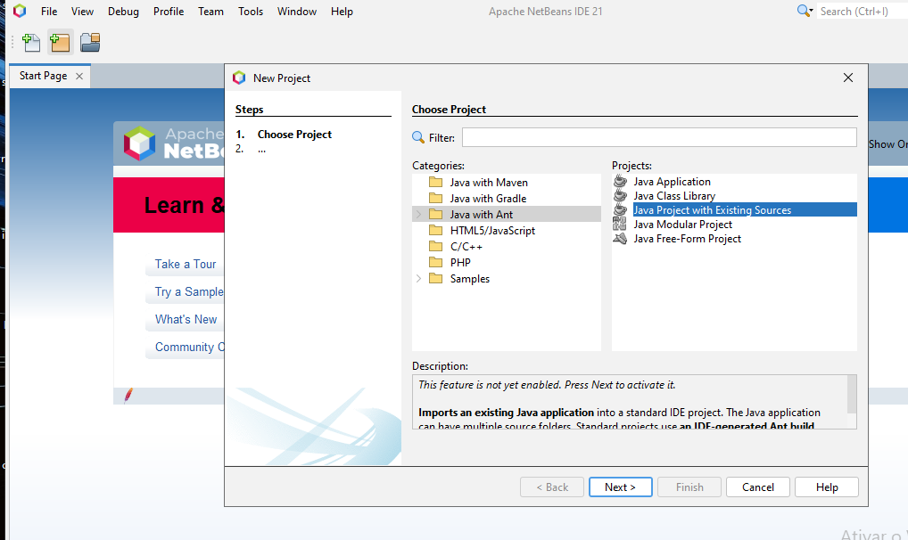
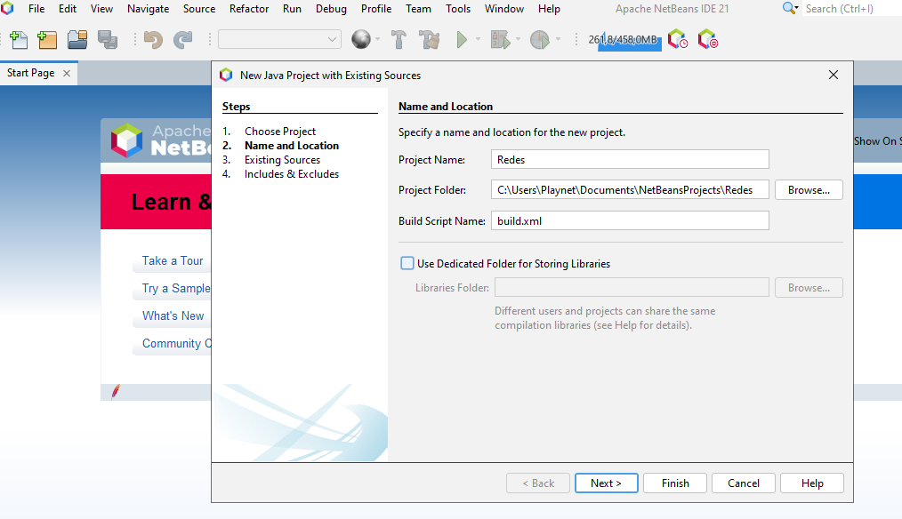
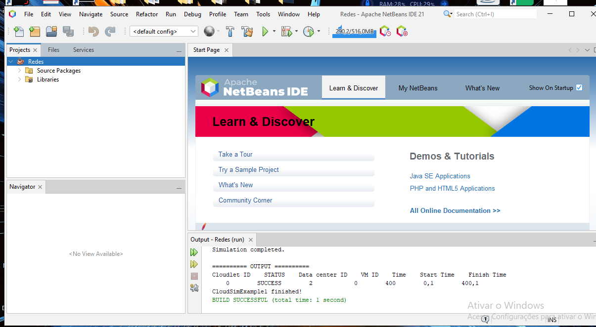
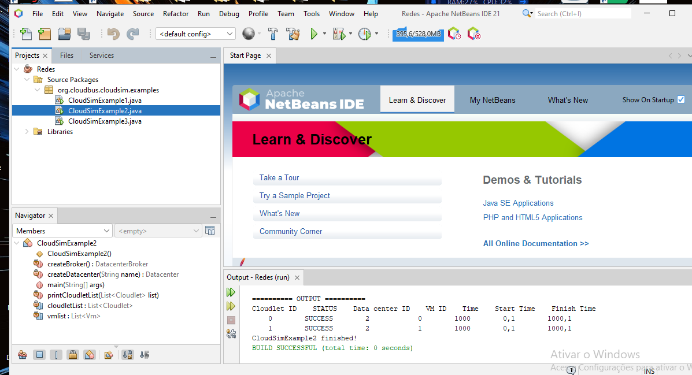
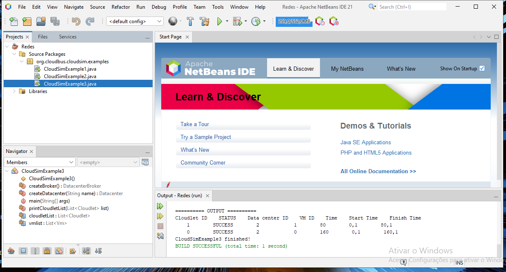

# Simulação em Nuvem com CloudSim

Este repositório contém os arquivos da atividade prática da disciplina de Cloud da Universidade Anhanguera, utilizando o framework **CloudSim** para simulação de ambientes de computação em nuvem.

## 👨‍🎓 Autor
**Marcelo Rodrigues**  
Curso: Ciência da Computação  
Universidade Anhanguera  

## 📋 Objetivo
Demonstrar a criação e execução de simulações com o framework CloudSim no ambiente de desenvolvimento Apache NetBeans.

## 🧰 Tecnologias Utilizadas
- Java (OpenJDK 19)
- Apache NetBeans IDE 21
- CloudSim 5.0

## 📂 Estrutura
- `src/`: Códigos dos exemplos CloudSim.
- `imagens/`: Capturas de tela das etapas do projeto.
- `Relatorio_CloudSim_Marcelo_Rodrigues_Anhanguera.docx`: Documento completo com introdução, execução e conclusão da atividade.

## 🚀 Como Executar
1. Instale o JDK e o NetBeans.
2. Crie um projeto Java com fontes existentes.
3. Importe os arquivos `.java` da pasta `src`.
4. Compile e execute os exemplos: `CloudSimExample1`, `CloudSimExample2` e `CloudSimExample3`.

## 🖼️ Exemplos de Execução
Veja abaixo alguns exemplos da execução no console do NetBeans:
### Iniciando o Projeto

### Configuração do Projeto

### Execução dos Testes

---

## 📄 Relatório
O relatório completo da atividade está disponível no arquivo:
**[Realatorio do Projeto](Relatorio_CloudSim_Marcelo_Rodrigues_Anhanguera.docx)**

---

## 📌 Licença
Este projeto é de uso acadêmico.

